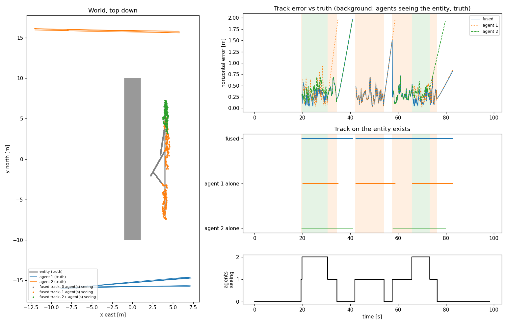
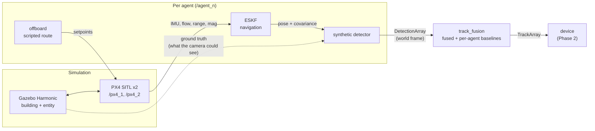

# coop-perception-sim

Cooperative perception in simulation. Several airborne agents watch a scene,
detect an entity of interest on board, and share compact results with a
mobile device on the ground. The device fuses them, so it can "see" an
entity that is hidden from where it stands but visible to at least one agent.
The question the project is building towards: how fast, and how accurately,
does that picture reach the device as the link between them degrades?

Everything runs on the same stack a real vehicle would: **PX4** SITL for
flight control, **Gazebo Harmonic** for physics and sensors, and **ROS 2**
nodes in C++20 for navigation, detection and fusion. There is no hardware.



*Phase 1, one scored run. Left: the building (grey), the entity's path behind
it, the two agents' routes on either side, and the fused track, coloured by
how many agents were seeing the entity (green both, amber one, grey nobody:
the track is coasting on prediction). Right: horizontal error of the fused
track and of each agent alone, when each tracker had a track at all, and the
true visibility timeline.*

## Phase 1: two agents, one fused track

Two agents fly scripted routes on either side of a building while the entity
walks behind it. At any moment nobody, one, or both of them can see it. Each
agent localises itself with its own error-state Kalman filter and detects the
entity with a synthetic detector, and a tracker fuses both agents' detections
into one track. The same tracker fed by one agent at a time is the baseline.
The link is perfect in this phase.

Over three scored runs (a fourth, with the GUI, is in the same range; a
fifth failed, see "Things that broke"):

| | **fused** | agent 1 alone | agent 2 alone |
|---|---|---|---|
| track continuity (share of the time someone could see the entity) | **0.985-0.991** | 0.86-0.88 | 0.69-0.72 |
| position error while visible (horizontal RMS) | **0.39-0.55 m** | 0.53-0.64 m | 0.45-0.70 m |
| ID switches per run | **0-1** | 2 | 1 |
| time to first track | 0.23-0.40 s | 0.30-0.42 s | 0.24-2.10 s |

The biggest gain from fusion is coverage. Either agent alone loses the entity
for an eighth to a third of the time some agent could see it; together they
almost never do, and the fused track coasts through the gaps where nobody sees
it. Accuracy improves too, but less than it could, for a reason worth its own
bullet below. On the real-time side, the fusion node's ingest callback
averaged 3-5 us (worst case 222 us, in the GUI run, against a 500 us budget), with zero heap
allocations in its callbacks.

The full write-up, with metric definitions and every finding, is
[docs/phase1_two_agent_fusion.md](docs/phase1_two_agent_fusion.md).

## Why it's built this way

- **The detector interface is the real one.** The synthetic detector computes
  what a camera could see from ground truth (field of view, range, a ray cast
  against the building, noise, missed frames), but it publishes exactly what
  a camera detector would: world-frame positions with covariances, one message
  per frame, empty or not. A YOLO-on-camera detector can replace it without
  touching anything downstream.
- **Navigation error is part of perception.** Each detection is placed in the
  world with the agent's *own* position and attitude estimate, not the true
  one, and the estimator's uncertainty is part of its covariance. That turned
  out to matter more than detector noise (below).
- **The world file is the occlusion model.** The detector reads the building
  straight out of the Gazebo world with libsdformat, so what blocks the view
  in the physics is exactly what blocks it in the detector.
- **Small messages, from day one.** A frame with one detection is 68 bytes on
  the wire, a track 64. Phase 3 pushes these through a bandwidth-limited link,
  so the format was designed for that before there was a link.
- **Real-time discipline, measured.** The fusion node has a dedicated ingest
  thread, fixed-capacity storage, a non-blocking hand-off, and live counters
  for callback time and heap allocations. Its callbacks averaged 3-5 us,
  and the counter read zero allocations in every run.
- **Scored, not eyeballed.** Every run ends with an evaluation against
  Gazebo's ground truth, with thresholds set in advance, comparing the fused
  track against each agent on its own.

## Reused from quad-autonomy-sim

This project builds on my earlier
[quad-autonomy-sim](https://github.com/W7RP/quad-autonomy-sim) and copies two
pieces of it into this repo. **agent_offboard** is its offboard flight node,
which takes off, flies a waypoint route with velocity setpoints and lands.
**agent_estimation** is its hand-rolled C++20 ESKF (IMU, optical flow,
rangefinder, magnetometer), along with the real-time instruments built for
it. Both were designed and validated there; the changes for running several
agents are listed in [docs/estimation.md](docs/estimation.md). The toolchain
(PX4 build, Gazebo, ROS 2, the XRCE agent) is the one that project installed,
and its two PX4 patches and parameter files are reused as-is.

## Things that broke

- **Both agents ran away as soon as they took off.** On the ground everything
  looked fine. In the air, both agents' velocity estimates fell behind,
  they accelerated east past 20 m/s, and PX4 blind-landed them. One agent
  alone flew perfectly. The cause was in PX4's simulated optical-flow sensor:
  its feature tracker keeps the previous image and tracked corners in
  file-level `static` variables, shared by every flow sensor in the Gazebo
  process. With two vehicles, each one tracked features across the *other*
  vehicle's images. A small patch gives each sensor its own tracker state
  ([firmware/README.md](firmware/README.md)).
- **Navigation, not detection, dominates the fused error.** One agent's ESKF
  drifted 0.6 m early in the flight while reporting 0.16 m of uncertainty, so
  all its detections landed 0.6 m east of the entity with too-small
  covariances. Fusion then puts the track between the two agents' biases.
  With perfect navigation the same scenario gives a fused error of 0.22 m,
  half of what it is with the agents' own estimates.
  Estimating each agent's bias from jointly seen entities is on the roadmap.
  In the worst case it fails a run outright: in 1 of 6 runs a burst of lost
  IMU samples jumped one agent's estimate by 1 m while it still reported
  0.24 m of uncertainty, and fusion, trusting that agent, did worse than the
  other agent alone. The demo fails that run, as it should; the cause and the
  candidate fixes are in the write-up.
- **One outlier could steal a track.** A unit test found that a single
  4-sigma detection starts a tentative track whose wide covariance makes the
  next real detections look closer to it than to the established track.
  Association now ranks by likelihood instead of distance, and established
  tracks pick first.
- **Tracks died while their predictions were still good.** Deleting coasting
  tracks at 4 m of uncertainty killed them about 4 s into an occlusion, when
  the prediction was still within 0.6 m. That cost an ID switch each time the
  entity reappeared. The limit is now 8 m, and the 10 s timeout decides.
- **The simulation ran at a fifth of real time.** Two 50 Hz flow cameras
  rendering shadows headless was too much. Turning shadows off brought it
  back to about 0.9x.
- **Parameter files silently did nothing.** A node name without its
  namespace (`detector:`) doesn't match `/agent_1/detector`, and ROS 2
  ignores the mismatch without an error. The first detectors started with no
  world file, and the ESKFs listened to the wrong PX4.

## How it fits together



| package | what |
|---|---|
| `coop_msgs` | compact detection and track messages |
| `agent_offboard` | offboard flight node (from quad-autonomy-sim) |
| `agent_estimation` | the ESKF (from quad-autonomy-sim) and the shared real-time instruments |
| `synthetic_detector` | sensor model, detector node, Gazebo ground-truth bridge |
| `track_fusion` | Kalman filter, swappable associators, tracker, fusion node |

Nodes, topics, frames and timing are in
[docs/architecture.md](docs/architecture.md).

```
firmware/     PX4 parameters and patches (incl. the multi-vehicle optical-flow fix)
sim/          Gazebo world, entity model, scenario file, RViz view
ros2_ws/src/  the five packages above
scripts/      simulator launcher, demo, evaluation, environment checks
docs/         architecture, per-phase write-ups, roadmap, environment
```

## Roadmap

| phase | what it adds | status |
|---|---|---|
| 1. Two-agent fusion | two agents, one hidden entity, perfect link, one fused track, scored against ground truth | done, tag `phase1-two-agent-fusion` |
| 2. The device | a ground node with its own pose and its own occlusion-aware view, fusing what the agents send | planned |
| 3. The link | bandwidth caps with priority queues, latency, jitter, range- and occlusion-dependent loss, outages; latency and accuracy against link quality are the headline result | planned |
| 4. More agents | more agents and coverage-aware patrol planning | planned |

The plan for each is in [docs/roadmap.md](docs/roadmap.md).

## Running it

Built on WSL2 with Ubuntu 22.04, ROS 2 Humble, PX4 v1.17.0 and Gazebo
Harmonic 8.15, reusing quad-autonomy-sim's toolchain. Setup, manual runs and
the output files are in [docs/running.md](docs/running.md). Exact versions
are in [docs/environment.md](docs/environment.md).

**Phase 1.** `./scripts/demo_phase1.sh` runs the whole thing headless and
scores it (`--gui` adds the Gazebo GUI and RViz). It clears any stale
simulator first, and exits 0 only if both agents completed their routes and
the fused track met its thresholds. It takes about three and a half minutes.

**Phases 2-4.** Not built yet.

## License

MIT, see [LICENSE](LICENSE). The patches in `firmware/px4_patches` modify PX4
and PX4-OpticalFlow and stay under their BSD 3-Clause licenses.
