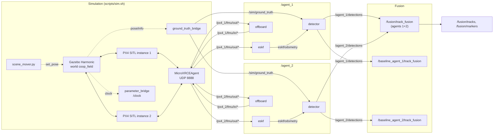

# Architecture

How the pieces fit, what talks to what, and the conventions every node
follows. Phase-specific design and results are in the phase write-ups.
Phase 2 adds the ground device; its nodes and topics are listed after the
Phase 1 diagram.

## Nodes and topics (Phase 1)

Dotted lines are simulation-only plumbing: nothing on the perception side
depends on them except through `/sim/ground_truth`, which only the synthetic
detector (to decide what its camera can see) and the evaluation read.

| topic | type | from | to | notes |
|---|---|---|---|---|
| `/clock` | rosgraph_msgs/Clock | Gazebo via ros_gz_bridge | every node | all nodes run with `use_sim_time` |
| `/px4_<n>/fmu/{in,out}/*` | px4_msgs | PX4 instance n via XRCE agent | offboard, eskf | PX4 namespaces instance n itself |
| `/sim/ground_truth` | tf2_msgs/TFMessage | ground_truth_bridge | detectors, evaluation | world poses of `entity`, `agent_<n>`, stamped with sim time; also on `/tf` for RViz |
| `/sim/scene_markers` | visualization_msgs/MarkerArray | ground_truth_bridge | RViz | occluders read from the world file, latched |
| `/agent_<n>/eskf/odometry` | nav_msgs/Odometry | eskf | detector | ENU/FLU, relative to the agent's start point |
| `/agent_<n>/detections` | coop_msgs/DetectionArray | detector | fusion | **the interface a camera detector must keep** |
| `/agent_<n>/visibility_truth` | coop_msgs/VisibilityTruth | detector | evaluation | ground truth, never on a link |
| `/fusion/tracks` | coop_msgs/TrackArray | fusion | (Phase 2: the device) | all tracks predicted to publish time |
| `/fusion/markers` | visualization_msgs/MarkerArray | fusion | RViz | coloured by agents contributing, 2-sigma ellipse |
| `/baseline_agent_<n>/tracks` | coop_msgs/TrackArray | baseline fusion | evaluation | the same tracker fed by agent n only |
| `/diagnostics` | diagnostic_msgs/DiagnosticArray | eskf, fusion | evaluation | real-time counters, named by node |

## The device (Phase 2)

| node / topic | what |
|---|---|
| `device` model in the world | a 640 x 480, 15 Hz camera at 1.6 m, moved by `scene_mover.py` |
| `/device/camera/image`, `/device/camera/camera_info` | the camera, bridged by the same `parameter_bridge` process as `/clock` |
| `/device/track_fusion` -> `/device/tracks` | the Phase 1 tracker, run at the device on both agents' detections |
| `/device/overlay` -> `/device/overlay/image` | the see-through view: every track drawn on the device's image |
| `/device/overlay/truth` (coop_msgs/OverlayTruth) | per frame, how the overlay matched the truth (evaluation only) |
| `device` in `/sim/ground_truth` | the device's pose (Phase 2 assumes a well-localised device) |

## The playable scene (Phase 3)

| node / topic | what |
|---|---|
| `/device/device_controller` | drives the device from `~/cmd` (teleop) with the walker model; publishes `/device/status` in every mode |
| `/device/game_view` | the game window: overlay image, minimap with fog of war, HUD; keyboard and mouse to `/device/device_controller/cmd`; `/game/quit` when you end |
| `/overwatch_planner` -> `/agent_<n>/goal` (coop_msgs/AgentGoal) | places the agents around the device, once a second |
| `/agent_<n>/status` (coop_msgs/AgentStatus) | each agent's own position report and camera coverage (from its detector) |
| `/device/status` (coop_msgs/DeviceStatus) | the device's pose, the one message that flows from the device up to the agents |
| `/agent_<n>/offboard` (`route_source: goal`) | flies the planner's goals |
| detector `pose_source: px4` | detections placed with PX4's EKF2 odometry (GPS agents) |

## Frames

- **world**: Gazebo's world frame, ENU (x east, y north, z up), metres. Every
  detection and track is in it. There is no per-message `frame_id`: the
  message set is world-frame by definition, which saves a string per message.
- **PX4 local NED**, per agent: only at the PX4 boundary (offboard setpoints,
  EKF2's local position). Each instance's origin is its own start point.
- **ESKF output**: ENU/FLU relative to where the ESKF initialised, which is the
  agent's start point. The detector adds that surveyed start position
  (`origin_world_enu`, from the scenario) to place the agent in the world.
- **Body**: FLU, as Gazebo models and REP-103 odometry use. The camera is the
  body frame pitched down by its mount angle.

## Time

Everything runs on simulation time from `/clock`. Stamps mean "when the thing
happened": a detection carries the time of the ground-truth sample it was made
from, and a track array carries the time its tracks were predicted to.
PX4's own timestamps are raw PX4 time, which in SITL follows the simulation
clock: this repo turns off uXRCE-DDS timestamp synchronisation
(`UXRCE_DDS_SYNCT 0`), which otherwise re-maps them to the agent's wall clock
and corrects that mapping in steps whenever the simulation runs below real
time (Phase 2 write-up, "Findings"). They are used only inside the ESKF. Messages sent
*to* PX4 are stamped 0 ("stamp on arrival"), the fix quad-autonomy-sim found
for offboard setpoints looking stale.

## Real-time discipline

The fusion node and the ESKF share one design and one set of instruments
(`agent_estimation`'s `TimingStats`, `FixedRing`, `alloc_probe`):

- a dedicated ingest/sensor thread whose callbacks do bounded work on
  fixed-capacity storage and never allocate;
- a separate output thread for everything that allocates (messages, markers,
  logging, parameter services);
- a hand-off from the first to the second with `try_lock`, so the hot path
  never blocks;
- live counters on `/diagnostics`: callback time histogram (mean, p99, max),
  overruns against a budget, and heap allocations counted by a replaced
  `operator new`, both inside our callbacks and on the whole thread.

## Messages (`coop_msgs`)

Small on purpose, because Phase 4 pushes them through a bandwidth-limited
link model. Measured CDR sizes:

| message | size |
|---|---|
| `DetectionArray` | 24 bytes + 44 per detection (a frame with one detection is 68 bytes) |
| `TrackArray` | 20 bytes + 64 per track |

A `Detection` is class, confidence, world position and the 6 unique entries of
its position covariance. `DetectionArray` adds the capture time, the source
agent and a per-agent frame counter (so a receiver can count frames the link
lost). `Track` carries id, class, status, a bit mask of the agents that
contributed recently, last update time, position, velocity and position
covariance. `VisibilityTruth` is evaluation-only.

## Packages

| package | language | what |
|---|---|---|
| `coop_msgs` | msg | the message set above |
| `agent_offboard` | C++20 | offboard flight node (copied from quad-autonomy-sim) |
| `agent_estimation` | C++20 | the ESKF (copied from quad-autonomy-sim) and the shared real-time instruments |
| `synthetic_detector` | C++20 | sensor model (FOV, range, ray-cast occlusion, noise, dropout), detector node, ground-truth bridge |
| `track_fusion` | C++20 | Kalman filter, associators, tracker, reorder buffer, fusion node |
| `device_view` | C++20 | the see-through overlay (projection, box, silhouette, ellipse, styles), the device controller (walker model), the game window (SDL2, minimap, fog of war) |
| `overwatch` | C++20 | the planner that places the agents around the device (hidden ground, candidate spots, greedy coverage, hysteresis) |

Each C++ package keeps its logic in a ROS-free library with unit tests, and
the node is a thin I/O layer around it.
