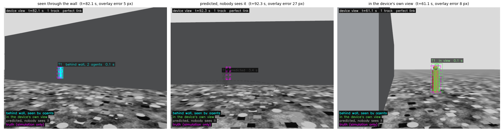

# Phase 2: the device and its see-through view (design record)

**Status: in progress.** Milestone 1 of 4 is done: the ground device, its
camera, fusion at the device, and the see-through overlay (box and person
outline), scored against ground truth. Still to come in this phase: the
skeleton overlay (2), registration of the agents' navigation bias (3), and
the comparison of fusing detections at the device against fusing agent-side
tracks (4); see [roadmap.md](roadmap.md).

The goal of the whole project, in one line: the agents in the air see for a
device on the ground, fast enough and accurately enough that the device can
see through walls. This phase builds the "see through walls" part.

## Results (milestone 1)

Three scored runs (A-C), headless, with the agents on their own ESKF
navigation. Each cell is A / B / C. In every run the entity was in the
device's field of view for the whole flight: behind the wall with some agent
seeing it for 386-402 frames (~26 s), in the device's own line of sight for
123-159 frames (~9 s).



*Run C, the device's own camera. Left: the entity is behind the building,
two agents see it, and it is drawn where it is (cyan; the dashed magenta box
is the truth). Middle: nobody has seen it for 3.4 s; the grey dashed
prediction and its 2-sigma ellipse. Right: the device has walked round the
corner and sees the real person, with the overlay on it (green). Each is the
median-error frame of its kind in that run.*

| overlay, per camera frame | A / B / C |
|---|---|
| see-through coverage (hidden from the device, some agent sees it) | **0.990 / 0.993 / 0.990** |
| pixel error, see-through, median / p90 | **5.3 / 10.3 / 5.9 px** / 10.7 / 16.2 / 11.7 px |
| pixel error, in the device's own view, median | 7.2 / 8.9 / 8.1 px |
| box IoU, see-through, median | 0.57 / 0.29 / 0.52 |
| world error of the drawn track, see-through, median | 0.31 / 0.47 / 0.24 m |
| data age when drawn, live, median / p90 | 0.08 / 0.06 / 0.13 s / 0.14 / 0.10 / 0.20 s |
| time to first overlay (first sighting by any agent) | 0.22 / 0.24 / 0.39 s |
| hidden coverage including coasting (reported, not scored) | 0.57 / 0.57 / 0.58 |

| tracks | **device (both agents)** | agent 1 alone | agent 2 alone |
|---|---|---|---|
| RMSE while some agent sees it | **0.34 / 0.47 / 0.33 m** | 0.62 / 0.58 / 0.57 m | 0.49 / 0.62 / 0.35 m |
| continuity | **0.993 / 0.993 / 0.993** | 0.867 / 0.880 / 0.887 | 0.697 / 0.691 / 0.700 |
| ID switches | **0 / 0 / 0** | 2 / 2 / 2 | 1 / 1 / 1 |

The agents' own navigation (ESKF vs truth, horizontal RMS) was 0.21-0.36 m in
every run, and their ESKFs logged 0-1 IMU gaps per flight (see "Findings").
The device's tracker ran at 3.0-4.7 us per ingest callback on average, worst
case 155 us against a 500 us budget, with zero heap allocations in its
callbacks.

How to read it:
- **The capability works.** Whenever the entity was hidden from the device
  but visible to an agent, it was highlighted in 99 % of the frames, a few
  pixels from where it really was, from data about a tenth of a second old.
  The 1 % is the time a new track takes to confirm (3 detections).
- **The overlay error is the track error.** 5-10 px median at 16-21 m is
  0.2-0.5 m, the drawn track's world error; the projection is exact against
  the pinhole model (unit-tested), so the pixel error comes from the track. When the
  device walks round the corner, the overlay lands on the real person at
  7-9 px.
- **Hidden coverage is 57 %** because for the rest of the time nobody sees the
  entity and the track is coasting or has been dropped (10 s without a
  detection). Those frames are drawn grey, with a growing ellipse, so the
  device's user can tell a live highlight from a guess.
- **Data age on a perfect link is ~0.1 s**, the pipeline's own latency
  (10 Hz detections, 10 Hz track output, 15 Hz camera). That is the baseline
  Phase 4 will degrade.

## What the device is

A camera on a 1.6 m post (`sim/models/device`), 640 x 480 at 15 Hz with a
70 deg horizontal field of view, the height of a hand-held or tripod camera.
It is kinematic, like the entity: `scripts/scene_mover.py` walks it back and
forth at 0.7 m/s from the building's west side (x = -12), where the building
hides the entity, round its south end to (3, -13), where it has a direct view,
and back. The camera always faces the middle of the entity's path, so the
entity is in the frame, behind the wall or not, for the whole flight. The
walk is a ~85 s round trip, and the device has a direct line of sight for
about 12 s of it; the rest of the time only the agents can see the entity.

The device knows where it is: Phase 2 takes its pose from the simulator's
ground truth. That is a deliberate simplification, so the overlay's error is
the track's error and not the device's own localisation (which would add to
it in the same way the agents' navigation error adds to their detections).

## Fusion at the device

The device runs the Phase 1 tracker, unchanged, on both agents' detections
(`/device/track_fusion`, output `/device/tracks`). On the perfect link that is
the same picture Phase 1's `/fusion` produced; the point of moving it is that
Phase 4's link model will sit between the agents and the device. The
single-agent baselines run alongside, as in Phase 1.

## The overlay

`device_view` (C++20). The geometry is ROS- and OpenCV-free in
`overlay_geometry.cpp` and unit-tested; `overlay_node.cpp` does the drawing.
For every camera frame:

1. The device's camera pose at the frame's capture time (device pose, camera
   mount).
2. Every confirmed or coasting track, predicted from the track array's time
   to the frame's time with its own velocity (constant velocity), then:
   - **box**: an upright 3D box of the entity's class size (0.5 x 0.5 x
     1.75 m for a person), standing where the track says, turned to its
     direction of travel, projected with the camera's intrinsics
     (`camera_info`);
   - **outline**: a person silhouette inside the box, a flat cut-out turned to
     face the camera, filled translucently;
   - **uncertainty**: the track's 2-sigma position ellipse, projected onto the
     ground;
   - **label**: track id, why it is drawn, and the age of its newest detection.
3. The style says how to read it:

| style | when | meaning |
|---|---|---|
| cyan, solid, filled | the device has no line of sight to the track's position, and an agent contributed a detection in the last 0.5 s | **seen through the wall**: live data from the agents |
| green | the device has a line of sight itself | the device could see it anyway: a check that overlay and reality agree |
| grey, dashed, unfilled | no line of sight, and no agent sees it now | prediction only; the ellipse shows how far it may have gone |

   Everything fades as the data gets older (full at 0 s, a quarter at 4 s).
   Line of sight is the same ray cast against the world file's boxes that the
   detectors use.
4. In simulation, an optional **truth ghost** (dashed magenta box at the
   entity's true position) shows the error frame by frame. It is drawn only
   for inspection and scoring; nothing drawn for a track depends on it.

Outputs: `/device/overlay/image` (live, e.g. in RViz or `rqt_image_view`),
`overlay.mp4` and a PNG still every 2 s of simulation time in the demo's log
directory, and `/device/overlay/truth`, one evaluation record per frame.

**Why a silhouette and not a skeleton yet.** The silhouette is drawn from the
track (position, heading, class): it costs nothing on the link and reads as a
person at any distance. A skeleton has to be *measured* by the agents (body
keypoints) and sent, about 200 bytes per person per frame; that is
milestone 2, and in Phase 4 it becomes the first thing a bad link drops.

## Evaluation

`scripts/eval_phase2.py`, per camera frame, against the simulator's truth:

- **see-through coverage**: of the frames in which the entity is in the
  device's field of view but hidden from it, *and* at least one agent sees it,
  the fraction with a track drawn on it (the nearest drawn track within 2 m of
  the entity). This is the capability: an entity that someone can see, and the
  device cannot, is highlighted.
- **hidden coverage**: the same, whether or not an agent sees it (coasting
  counts). Reported, not scored: it mostly measures how long tracks survive.
- **pixel error**: distance between the centres of the drawn box and the true
  box in the image. **IoU** of the two boxes.
- **data age**: frame time minus the newest detection in the drawn track,
  while agents see the entity. On a perfect link this is the pipeline's own
  latency: detector frame rate, fusion publish rate, camera frame rate.
- **time to first overlay**: first sighting by any agent to the first frame
  with the entity highlighted.
- The Phase 1 track metrics, for the device's track and each agent alone.

### Acceptance (`--check`)

| metric | threshold | reasoning |
|---|---|---|
| see-through coverage | >= 0.90 | the fused track's continuity was 0.98-0.99 in Phase 1; the image adds only projection |
| pixel error, median | <= 20 px | behind the wall the entity is mostly 16-21 m from the device; at a 457 px focal length, 0.5 m of track error (Phase 1's typical) is 11-14 px there |
| data age, p90, live | <= 0.30 s | 10 Hz detections, 10 Hz track output and a 15 Hz camera add up to at most ~0.25 s |
| time to first overlay | <= 1.0 s | Phase 1's time to first track plus one camera frame |
| device track RMSE while visible | <= 0.75 m | as Phase 1 |

These were fixed after the shakedown runs described below and before the
scored runs.

## Findings along the way

| finding | how it showed up | fix |
|---|---|---|
| **uXRCE-DDS timestamp synchronisation corrupted the agents' IMU timeline in SITL.** It converts PX4 time to the agent's wall clock; PX4 time follows the simulation, which runs at ~0.85x real time with the device camera, so the mapping drifts and is corrected in steps. | With the device camera added, every run's ESKFs logged 63-206 IMU gaps (Phase 1: 0-80), and one agent's navigation error reached 0.7-1.1 m, visible in the image as the overlay standing a metre beside the real person. Recording the raw IMU stream showed **no sample was lost**: 8,139 samples per flight either way, but stamped across 131 s for a 98 s flight, with 169-185 apparent gaps and 7-8 jumps over 100 ms | `UXRCE_DDS_SYNCT 0` in `sitl_only.params`: PX4 stamps stay raw PX4 time, which in SITL is simulation time. After: 0-1 gaps per flight, navigation 0.21-0.36 m in every run. This is also the cause of Phase 1's intermittent failure (see its write-up) |
| **The first device route never gave it a view round the corner.** | Per-frame truth showed the entity hidden from the device in every frame: from (-4, -14) the building still blocks the line of sight to the whole path | The route now goes round the south end to (3, -13): ~9 s of direct view per flight |
| **A white truth ghost read as a coasting track.** | Grey dashed prediction and white dashed truth side by side in the first stills | The ghost is magenta |
| **Python OpenCV is broken on this machine** (NumPy 2 in `~/.local` against Ubuntu's cv2, the same conflict as matplotlib), and there is no ffmpeg | `import cv2` fails | Drawing, video (H.264 through OpenCV's writer) and stills are all in the C++ node |

## Limitations

- **The device's pose is ground truth** (see above).
- **Constant-velocity prediction to the frame time**, using the track's own
  velocity; the camera's 15 Hz and the tracker's 10 Hz output are not
  synchronised, so the drawn box can jump by up to one frame of motion.
- **The overlay only shows what the agents send.** The device has no detector
  of its own: when it can see the entity directly but no agent can, nothing is
  drawn. A device detector is a natural addition, and would also let the
  device check the agents' tracks against its own view (registration).
- **One entity**, a static shape: the skeleton needs an animated one
  (milestone 2).
- **The truth ghost and the scoring use simulator truth**; the drawing does
  not.

## Reproduce

```bash
./scripts/demo_phase2.sh                  # headless, scored; overlay.mp4 and stills in the log dir
./scripts/demo_phase2.sh --gui            # Gazebo, RViz with the device's view live
RECORD_IMU=1 ./scripts/demo_phase2.sh     # also record the agents' raw PX4 IMU streams
```

By hand: `scripts/sim.sh`, `scripts/stack.sh --device --rviz`,
`scripts/fly.sh`. Details in [running.md](running.md).
