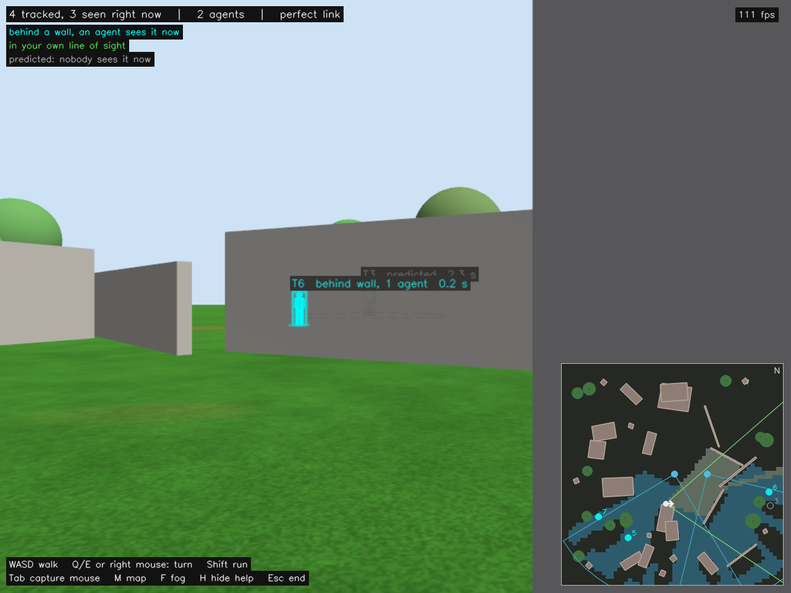

# Phase 3: the playable scene (design record)

**Status: done.** You are the ground device. You walk a generated map in a
game window (WASD and mouse), and the entities hidden behind its buildings,
walls, containers and trees are highlighted where they really are, because
two agents in the air, placed by a planner around you, see them for you.
The same session runs scripted and headless as a scored benchmark.

Nothing in the game layer feeds the system anything it would not have in
reality: the overlay, the minimap and the planner use only what the device and
the agents report, and the map. Ground truth drives the simulator and the
scoring, nothing else (see "Honesty rules" below).

## Results

Three scored sessions (A-C) on map 7: four entities, two GPS agents placed
by the planner, the device walking its scripted loop through the middle of
the map for 150 s of simulation (about 170 s including takeoff and landing).
Each cell is A / B / C. The see-through numbers are within the planner's
26 m radius of interest around the device.



| the see-through view | A / B / C |
|---|---|
| see-through availability (hidden from the device, some agent sees it) | 0.39 / 0.35 / 0.43 |
| **see-through coverage** (of that, highlighted) | **0.935 / 0.925 / 0.964** |
| pixel error, median / p90 | **8.5 / 6.6 / 7.7 px** / 16.5 / 16.6 / 14.7 px |
| world error of the drawn track, median | 0.32 / 0.27 / 0.28 m |
| data age when drawn, median / p90 | 0.16 / 0.08 / 0.11 s / 0.22 / 0.16 / 0.20 s |

| the device's picture of all four entities | **device** | agent 1 alone | agent 2 alone |
|---|---|---|---|
| MOTA | **0.964 / 0.974 / 0.961** | 0.674 / 0.673 / 0.681 | 0.397 / 0.431 / 0.413 |
| continuity | 0.971 / 0.982 / 0.970 | 0.678 / 0.678 / 0.685 | 0.406 / 0.441 / 0.422 |
| ID switches (per session) | 17 / 17 / 20 | 9 / 9 / 10 | 21 / 20 / 20 |
| prediction accuracy (coasting within 2 m) | 0.64 / 0.67 / 0.66 | 0.59 / 0.73 / 0.59 | 0.66 / 0.63 / 0.68 |

The device's tracker ran at 5.0-6.8 us per ingest callback on average (worst
205 us, budget 500 us) with zero heap allocations in its callbacks; a plan
took 2-9 ms. Two played sessions, driven through the game window by scripted
keys, scored see-through coverage 0.98 and MOTA 0.95. Phases 1 and 2 were
re-run on the final code and pass (Phase 1: fused RMSE 0.35 m while visible,
continuity 0.991; Phase 2: see-through coverage 0.990, 5.7 px).

How to read it:
- **When an agent can see someone you cannot, you see them too**, 93-96 % of
  the time, drawn 7-9 px (about 0.3 m) from where they are, from data about a
  tenth of a second old. The rest is track confirmation (3 detections) and
  people at the edge of an agent's view.
- **Two agents cover 35-43 % of the ground hidden from you** at any moment.
  That is the limit of two cameras on a map this cluttered, not of the
  pipeline: it is the number more agents (Phase 5) and smarter placement
  should move.
- **Fusion is what makes the picture usable**: MOTA 0.96-0.97 from both
  agents, against 0.67-0.68 and 0.40-0.43 from either alone.
- **ID switches, about 1.5 per person per minute**, come from re-acquisition:
  a person nobody has seen for a while is predicted in a straight line, they
  turn a corner, and when an agent sees them again the old track is too far
  away and a new one starts. Better motion models and re-identification
  would help; it is the most visible weakness in play.

## What changed from Phase 2

| piece | Phase 2 | Phase 3 |
|---|---|---|
| map | one building, grey | generated from a seed: buildings, walls, containers, crates, trees, grass and sky, in colour |
| entities | one, on a fixed back-and-forth path | several, each on its own closed walking loop through free space |
| device | walks a scripted route | **you drive it** (game window), or it walks a scripted loop (scored mode) |
| agents | scripted routes, optical-flow navigation (ESKF) | **placed by the overwatch planner around the device**, GPS navigation (PX4's EKF2) |
| occluders | boxes | boxes, cylinders (tree trunks) and spheres (canopies) |
| view | overlay image | a game window: the overlay full size, minimap with fog of war, HUD |

## The map

`sim/tools/generate_map.py --seed N` writes `sim/worlds/map_N.sdf` and
`sim/scenarios/map_N.yaml`. Deterministic: the same seed is the same map.

- Inside a square (60 m by default): buildings (4-12 m footprints, 3-8 m tall,
  brick, concrete and plaster colours), long thin walls, 6 m shipping
  containers, crates, and trees (a trunk cylinder and a canopy sphere, both
  occluders; only the trunk blocks walking).
- A clear plaza in the middle where the device starts, and one launch pad per
  agent at the edge.
- Every entity gets a closed loop of 5 waypoints whose every leg is checked
  against a walkable-space grid (footprints inflated by 0.6 m), so nobody walks
  through a wall.
- The agents' altitude is set from the tallest object: 4 m above it, each
  agent 2 m higher than the last, so they never share a height.
- Everything that hides is a box, cylinder or sphere collision on a static
  model, which is exactly what the detectors, the overlay, the planner, the
  minimap and the device's walking all read back from the world file. One
  geometry for physics, rendering, occlusion and collision.

The ground is `sim/models/grass_ground`: a generated, tileable grass texture
(25 m tile) with patches of dry grass and earth.

## Being the device

`scripts/demo_phase3.sh --play` opens the game window (`device_view`'s
`game_view`, SDL2):

| key | action |
|---|---|
| W / S, Up / Down | walk forward / back |
| A / D | step left / right |
| Q / E, Left / Right, or the mouse with the right button held | turn |
| Shift | run |
| Tab | capture the mouse (turn with it freely) |
| M / F / H | minimap / fog of war / help |
| Esc | end the session (the agents land and the session is scored) |

The keys become a velocity command; `device_controller` integrates it with a
walker model (1.6 m/s walking, 3.5 m/s running, 110 deg/s turning) that
collides with everything solid at body height and slides along it, and moves
the device's Gazebo model on the simulation clock. The camera is 960 x 720 at
30 Hz with a 75 deg field of view.

The window shows the device's camera with the see-through overlay (Phase 2's
styles: cyan behind a wall and seen by an agent now, green in your own line of
sight, grey dashed when only predicted), a HUD, and a north-up minimap:
buildings, trees, the device and its view, the agents and their view wedges,
the tracks, and **fog of war**: every metre of ground shaded by who can see it
right now, you (light), only an agent (blue) or nobody (dark), computed with
the detectors' own visibility model four times a second.

## The agents follow you: overwatch planning

`overwatch` (C++20, ROS-free core, unit-tested). Once a second:

1. **Hidden ground**: the cells within the radius of interest (26 m) of the
   device that it cannot see from eye height, whichever way it faces, leaving
   out cells inside obstacles. Cells within 3 m of a track the device holds
   count three times: keep watching people already found.
2. **Candidate spots** for each agent at its own altitude, on two rings around
   the device (0.6 R and R, R = 14 m, 24 azimuths each), camera facing the
   device and pitched 40 deg down.
3. **Coverage** of a spot: the hidden ground its camera would see (field of
   view, 35 m range, line of sight), in m^2.
4. **Greedy assignment**, agent by agent: the spot adding the most uncovered
   ground, minus a small travel cost, at least 8 m from the spots already
   chosen. Greedy is the standard tool for coverage: without the separation
   constraint it is guaranteed within 1 - 1/e (63 %) of the optimum.
5. **Hysteresis**: an agent follows its best spot as it shifts (within 3 m),
   but only jumps elsewhere if that is more than 15 % better than staying.

The planner sees only what the device knows: the device's own position
(`DeviceStatus`, the one message that goes up from the device to the air),
the tracks it holds, the agents' own position reports (`AgentStatus`), and the
map. A plan takes 2-9 ms.

The agents fly the planner's goals with `agent_offboard`'s new goal mode:
climb in place, fly to each new goal (position and camera heading, the yaw
rate-limited to 60 deg/s), hold between goals, land when told to.

**Why GPS agents here.** The ESKF assumes flat ground under its rangefinder;
over a map full of rooftops that assumption fails every few seconds. Phase 3's
agents are PX4's stock GPS `x500`, navigating on EKF2, and the detectors place
detections with PX4's odometry (`pose_source: px4`: position and attitude with
their variances). The ESKF keeps its place on the flat Phase 1 and 2 scenarios.
Dropping the downward flow cameras also frees rendering for the device's
larger camera.

## Scoring a session

`scripts/eval_phase3.py`, the same for a scored and a played session.

**The see-through view** (per camera frame and entity), within the planner's
radius of interest around the device (the whole field of view is reported
alongside):
- *see-through availability*: of the entity-time hidden from the device but in
  its view, the fraction some agent could see. What the planner's placement
  made possible.
- *see-through coverage*: of that seen-by-an-agent time, the fraction with the
  entity highlighted. What the pipeline delivered.
- pixel error, IoU, world error, data age, as in Phase 2.

**The device's picture of all entities** (10 Hz track samples), CLEAR MOT
style: live tracks (confirmed, updated in the last 0.5 s) are matched to
entities nearest-first within 2 m, over the moments an entity is visible to at
least one agent:
- *MOTA* = 1 - (misses + false tracks + ID switches) / entity-samples;
- *MOTP*, the mean error of matched tracks; *continuity*; ID switches;
- *prediction accuracy*: the share of coasting-track samples within 2 m of an
  entity. Coasting tracks are predictions, drawn as such; scoring them as
  false tracks would punish the display for being honest about them (see
  "Findings").

### Acceptance (scored mode)

| metric | threshold | reasoning |
|---|---|---|
| see-through coverage | >= 0.85 | Phase 2 reached 0.99 with one entity; several entities and a moving device lower it, association does the rest |
| pixel error, median | <= 25 px | at the 626 px focal length, 0.5 m of track error at 15-25 m is 13-21 px |
| data age, p90 | <= 0.30 s | the pipeline's own latency on a perfect link, as Phase 2 |
| MOTA | >= 0.70 | typical for multi-object tracking with occlusion; one agent alone should not reach it |

Set after the shakedown sessions described below, before the scored runs.

## Honesty rules

The game layer is a front end; the system underneath stays a proof of concept:

1. **No ground truth in the loop.** Only the simulator side (moving entities
   and device, deciding what each camera could see) and the scoring read true
   positions. The overlay draws the truth ghost only in scored mode, never in
   a played one.
2. **The minimap is the device's knowledge**: the map, its own position, the
   agents' own reports, its tracks.
3. **The agents' vision radius is a camera spec**: field of view, pitch and
   range in the scenario, the same numbers the detectors use.
4. **Every session is recorded and scorable**, played or scripted.

What this simulation does and does not claim about the real world is in
[real_world.md](real_world.md).

## Findings along the way

| finding | how it showed up | fix |
|---|---|---|
| **The "false tracks" were predictions.** | The first scoring counted 589 false-track samples and a MOTA of 0.68. Broken down: 588 were coasting tracks (people nobody currently saw) whose prediction had drifted a median 3 m; live tracks produced **one** false sample in the whole session | Multi-object metrics score live tracks; coasting accuracy is its own number (about 65 % within 2 m). The overlay already draws predictions grey and dashed, so this matches what the player sees |
| **Scoring against the whole camera view asked for the impossible.** | See-through availability 7 %: the hidden people in the device's view were a median 40 m away, beyond the planner's 26 m radius of interest and the agents' 35 m camera range | The headline numbers are scored within the planner's radius (the "defined radius" the agents cover); the whole view is reported alongside |
| **The first scripted walk stayed in one corner.** | Within the radius there were only 10 relevant frames, all before takeoff | The generated scripted loop goes round the middle of the map |
| **The planner counted ground inside buildings as hidden** (unit test). | Cells inside the wall were "hidden from the device" | Cells inside any obstacle are left out |
| **The planner's hysteresis was too literal** (unit test). | A 1 m device step shifted the hidden area enough that the old spot lost 18 % of its value, so the agent "jumped" to a spot 1 m away, and a good far spot could beat a nearly-as-good near one | Follow the best spot freely within 3 m; jump further only if 15 % better |
| **The overlay node died on a parameter type**, silently to the demo. | `draw_truth:=1` is an integer, the parameter a boolean; the demo waited only for tracks, so the session ran with no overlay | `true`/`false`, and the demo now also waits for the overlay's first image |
| **The ground repeated visibly from the air.** | Dirt patches every 5 m made a pattern; the texture PNG was 5.3 MB | A 25 m tile with softer, rarer patches, stored as a 0.9 MB JPEG |
| **The overlay's legend collided with the game's help, and the fps counter vanished against the sky.** | Game stills | With `draw_hud: false` the overlay leaves the HUD to the game window, which draws all text on dark backing boxes |
| **SciPy is broken on this machine** (the same NumPy 2 conflict as cv2 and matplotlib) | `import scipy.optimize` fails | Track-to-entity matching in plain NumPy, nearest first (a handful of entities, so greedy is fine) |

## Limitations

- **Scripted people**: they walk fixed loops at constant speed, turn corners
  instantly, and do not react to anything.
- **Synthetic detection**, as before: one ray to the entity's centre decides
  visibility; no false detections; canopies block like solid spheres.
- **The device's pose is exact** (see Phase 2).
- **The planner optimises the next second only**: no lookahead along your
  path, no memory of where people were last seen beyond the current tracks.
- **Two agents**, a 60 m map: one high unit on a larger map is Phase 4, more agents Phase 6.
- **Perfect link**: the degraded link is Phase 5.

## Reproduce

```bash
./scripts/demo_phase3.sh --play              # play (map 7)
./scripts/demo_phase3.sh                     # scored, headless
./scripts/demo_phase3.sh --seed 12 --play    # a new map, generated on first use
python3 sim/tools/generate_map.py --seed 12 --entities 6 --trees 20   # a denser one
```
