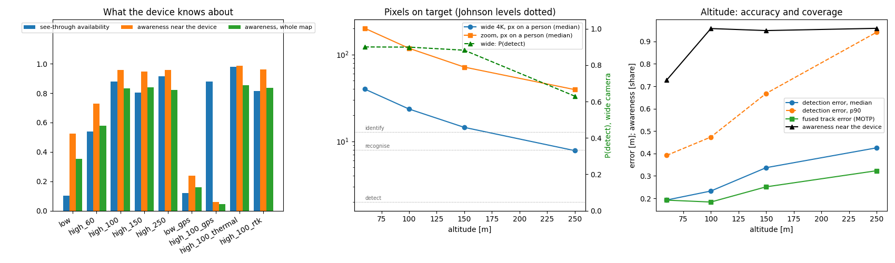
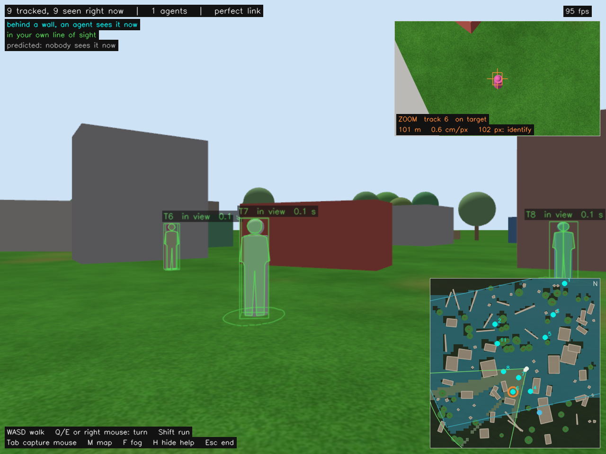

# Phase 4: the overwatch unit (design record)

**Status: done.** One agent, high enough that it does not need a swarm. A
single GPS multirotor holds station at 100 m near the ground device, with the
kind of payload a commercial inspection or mapping drone carries: a wide 4K
search camera looking steeply down, and a zoom camera on a stabilised gimbal
that takes a closer look at one person at a time. The device fuses what it
sends and highlights people through walls exactly as in Phase 3, and it now
shows the zoom camera's real rendered video as a picture-in-picture.

The question this phase answers: is one high unit with better sensors a
replacement for several low agents flying around the device? It is scored
against Phase 3's two low agents on the same map, the same people and the
same device route, then swept over altitude, given GPS-grade navigation
error, and given a thermal camera.

## Results

Nine scored sessions on map 11 (100 x 100 m, 10 people walking their loops,
6 of them around the middle), the device on the same scripted loop through
the middle each time, ~140-165 s scored on station per session. One session
per configuration, so differences of a few hundredths are within
session-to-session variation (which people happen to be near the device
when). Availability varies most (0.80-0.92 from 100 to 250 m, 0.81 and 0.88
for the two 100 m sessions with no and with RTK-grade error), because it is
scored only over the moments someone is hidden in the device's view: 300-450
entity-frames a session for the high unit, and only 41-47 for the low agents
(so their coverage of 1.00 says little). The "near" numbers are within the
planner's 30 m radius of interest.



| session | agents | altitude | nav error | see-through availability | coverage | awareness near / whole map | MOTA | detection error p50 / p90 | wide camera px, P(detect) | zoom px |
|---|---|---|---|---|---|---|---|---|---|---|
| low (Phase 3's agents) | 2 | 12-14 m | none | 0.10 | 1.00 | 0.53 / 0.35 | 0.952 | 0.36 / 0.82 m | - | - |
| high | 1 | 60 m | none | 0.54 | 1.00 | 0.73 / 0.58 | 0.962 | 0.19 / 0.39 m | 40 px, 0.90 | 200 px |
| **high** | **1** | **100 m** | none | **0.88** | **1.00** | **0.96 / 0.83** | **0.998** | 0.23 / 0.47 m | 24 px, 0.90 | 118 px |
| high | 1 | 150 m | none | 0.80 | 1.00 | 0.95 / 0.84 | 0.997 | 0.34 / 0.67 m | 14 px, 0.88 | 72 px |
| high | 1 | 250 m | none | 0.92 | 1.00 | 0.96 / 0.82 | 0.988 | 0.43 / 0.94 m | 8 px, 0.63 | 39 px |
| high + thermal | 1 | 100 m | none | **0.98** | 1.00 | **0.99 / 0.85** | 0.994 | 0.26 / 0.54 m | 24 px, 0.90 | 118 px |
| low | 2 | 12-14 m | GPS | 0.12 | 1.00 | 0.24 / 0.16 | -0.157 | 1.92 / 3.60 m | - | - |
| high | 1 | 100 m | GPS | 0.88 | **0.00** | 0.06 / 0.04 | -0.906 | 3.22 / 3.63 m | 23 px, 0.90 | 118 px |
| high | 1 | 100 m | RTK | 0.81 | 1.00 | 0.96 / 0.84 | 0.995 | 0.30 / 0.58 m | 24 px, 0.90 | 118 px |

*availability*: of the time a person is hidden from the device but in its
view, the share an agent could see them. *coverage*: of that, the share
highlighted on the device. *awareness*: of all the time, whether anyone can
see a person or not, the share the device holds a live track on them.
"GPS" is a constant error drawn once per agent from 1.5 m horizontal and
2.5 m vertical (1-sigma); "RTK" from 3 and 5 cm.

What it says:

- **One high unit replaces the swarm, and then some.** At 100 m, one agent
  sees 95 % of the people-time near the device and the device holds a live
  track on 96 % of it, against 53 % for the two low agents. Hidden people
  are available to be highlighted 88 % of the time instead of 10 %. From
  that height walls barely hide anyone: of what it misses near the device,
  84 % is under tree canopies, 16 % just outside the camera's footprint, and
  one frame in 544 behind something solid.
- **The same unit sees most of the map as a side effect** (83 % awareness
  over the whole 100 x 100 m, against 35 %), and its tracks are steadier:
  6 ID switches in a session against 22, because nobody walks out of view
  every few seconds.
- **Altitude: 60 m is too low, and pixels are not the limit until ~250 m.**
  At 60 m the footprint is too small (awareness 0.73, 28 ID switches as
  people cross its edges). From 100 m to 250 m awareness is flat at
  0.95-0.96. The 4K wide camera puts 24 px on a person at 100 m (2.7 cm per
  pixel, identification level), 14 px at 150 m and 8 px at 250 m, where its
  per-frame chance of detecting someone falls to 0.63; at 10 frames a second
  the tracker bridges that easily. What altitude does cost is accuracy: the
  detection error grows with range (median 0.19 m at 60 m, 0.43 m at 250 m,
  p90 0.39 to 0.94 m), because the pointing error is an angle.
- **The zoom is for looking, not for finding.** At every altitude tested it
  identifies (39-200 px on a person), and it spent 85-92 % of the time on a
  target, cycling through 10-12 tracks with a revisit every ~20 s. Detection
  and tracking never needed it here: the wide camera alone finds everyone it
  can see. Its value is the picture on the device: a person at 1-3 cm per
  pixel, enough to see what they are doing, which a real detector would also
  need for anything beyond "a person is there".
- **Thermal takes the canopy back.** A 640 x 512 thermal camera next to the
  wide one, passing each canopy with probability 0.3, lifts availability from
  0.88 to 0.98 and near awareness from 0.96 to 0.99.
- **Navigation error is the real limit, and a high unit is the most exposed
  to it.** With a plain-GPS-grade error the detections land where the error
  puts them: the high agent's draw was 3.4 m horizontally (a 2.2-sigma draw
  north) and its detections sit a median 3.2 m off. That is beyond what the
  overlay can call a match, so the highlight stands beside the person and the
  scores collapse (coverage 0.00, MOTA -0.91). The low agents drew the same
  errors (the draw is seeded by agent id: 3.4 m for agent 1, 1.6 m for
  agent 2); their detections end up a median 1.9 m off and MOTA drops to
  -0.16. Nothing in
  the imaging chain can fix this; RTK-grade navigation (a few centimetres)
  does, as the last row shows. Phase 1 found the same thing on a small scale
  ("navigation, not detection, dominates the fused error"); from 100 m it
  decides whether the concept works at all.

## What changed from Phase 3

| | Phase 3 | Phase 4 |
|---|---|---|
| agents | two, just above the rooftops (12-14 m) | one, at 100 m (swept 60-250 m) |
| sensors | one body camera each, 90 x 70 deg, range noise model | wide 4K (60 deg) body camera pitched 70 deg down, 30x zoom (6 deg) on a gimbal, optional 640 x 512 thermal |
| detection | visible = detected, minus 10 % missed frames | detection probability from pixels on target (Johnson criteria) |
| where a detection lands | camera-frame noise growing with range | ray through the pixel, intersected with the ground: pointing error, navigation error and its geometry |
| map | 60 x 60 m, 4 people | 100 x 100 m, 10 people (6 of them around the middle) |
| the device's view | overlay, minimap | overlay, minimap with each camera's ground footprint, zoom picture-in-picture |

What did not change: the tracker, the device's fusion and overlay, the
planner's placement method, the message set (two messages added), the
honesty rules. The low-agent profile of the same map runs Phase 3's code
unchanged.

## Sensors from specifications (`synthetic_detector/imaging.hpp`)

The Phase 1-3 detector sees an entity if a ray reaches it inside a field of
view and a range. That makes "higher" free: a 35 m range stands in for
everything a real camera gives up with distance. The imaging model replaces
the range with the camera's resolution:

1. **Pixels on target.** A person's *critical dimension* is the square root of
   their projected area as the camera sees them: 0.39 m looking straight down
   (shoulders and head only), about 0.85 m at 45 deg. Divide by the ground
   footprint of one pixel at the slant range. So a steep view is honestly
   harder than an oblique one, and so is distance.
2. **Detection probability** from pixels on target, with the target transfer
   probability function of the Johnson-criteria models:
   P = (N/N50)^E / (1 + (N/N50)^E), E = 2.7 + 0.7 N/N50. N50 is the number
   of pixels across the critical dimension at which the detector finds a
   person half the time: 6 px for an automated detector on visible imagery,
   3 px for a warm person on a thermal image. Times the detector's recall
   (0.9, as before).
3. **Johnson levels** for reporting: detect, recognise, identify at 2, 8 and
   12.8 px (1, 4 and 6.4 cycles, two pixels per cycle).
4. **Geolocation the way airborne payloads do it.** The true direction to the
   person, perturbed by the pixel error (0.5 px) and the gimbal/INS pointing
   error (0.05-0.1 deg), is taken from the camera's *estimated* pose and
   intersected with the ground at the person's reference height. Pointing
   error moves the result by R dtheta across the line of sight and
   R dtheta / sin(depression) along it; a navigation error moves it one for
   one, and a vertical one by dz / tan(depression). The detection's
   covariance says the same.
5. **Canopy.** Trees are solid to visible cameras; the thermal preset passes
   each canopy on the line of sight with probability 0.3 (sparse canopy).

| preset | spectrum | pixels | field of view | N50 | pointing | in this phase |
|---|---|---|---|---|---|---|
| `eo_wide_4k` | visible | 3840 x 2160 | 60 deg | 6 px | 0.1 deg | the search camera, body-mounted, 70 deg down |
| `eo_zoom_30x` | visible | 1920 x 1080 | 6 deg | 6 px | 0.05 deg | on the gimbal |
| `thermal_640` | long-wave IR | 640 x 512 | 32 deg | 3 px | 0.1 deg | optional (`--thermal`), body-mounted |

They are typical of commercial payloads, not a model of any product. At
100 m the wide camera's pixel is 2.7 cm on the ground; a person 116 m away at
60 deg depression is ~24 px across, well past identification. Each entity is
reported once per frame, by the camera most likely to detect it, so a person
under the zoom is not counted twice.

`nav_bias` adds what SITL's GPS lacks: a constant absolute error, drawn once
per agent from 1.5 m horizontal and 2.5 m vertical (plain GPS), with its
variance added to each detection's covariance. RTK would be a few
centimetres.

## The gimbal and the zoom

- **`gimbal_controller`** (agent_offboard, runs on the agent): points the zoom
  camera at a world point, turning at most 90 deg/s per axis, stabilised in
  the world (its angles are ENU yaw and depression, independent of the
  airframe). It stows straight down when it has no command. It publishes
  `GimbalState`, which the detector uses as the zoom camera's pointing.
- **`gimbal_sim`** (synthetic_detector, simulation only): moves a floating
  Gazebo camera model (`zoomcam_1`, 1280 x 720 at 6 deg, no collision) to the
  agent's true position and the gimbal's pointing, 30 times a second, so the
  zoom video is a real render of the scene.
- **The zoom scheduler** (overwatch, `zoom.hpp`): the planner's second job.
  It holds a track for at least 3 s, then moves to the track most overdue for
  a look: time since it was last looked at, plus a bonus if the device cannot
  see that spot itself, and another if the track is coasting (the camera goes
  looking for people who went quiet). Commands go up at 5 Hz.
- **Placement**: the Phase 3 planner, unchanged, with one agent at 100 m and
  the wide camera's coverage (60 x 36 deg, 70 deg down): it picks a spot on
  a 30 m ring around the device, facing it. From there the camera covers
  from almost under the drone to ~80 m beyond, and 120 m across.

## Being the device, with a zoom

The game window gains the zoom camera's video (top right) with a reticle, a
box the size of a person at that range, and a two-line label: the track it
is on, on target or slewing, slant range, ground resolution, and the Johnson
level a person would reach. All of it is computed on the device from what it
has: the agent's own position report, the track, and the camera's spec. The
minimap draws a steep camera's ground footprint instead of a wedge (the high
camera's covers most of the map) and rings the track the zoom is on.



## Scoring

`scripts/eval_phase4.py`: everything from Phase 3, from the moment every
agent is on station (at altitude and at its planner goal) to the planner's
land command, so a climb to 100 m, which takes a minute longer than one to
12 m, does not count against it. Added:

- **awareness**: the share of *all* entity-time, visible or not, with a live
  device track on the person; near the device (the 30 m radius of interest)
  and over the whole map;
- **seen**: the share of entity-time some agent's camera could see;
- **detection error**: single detections against the truth;
- **imaging**: per camera, pixels on target, detection probability, Johnson
  level shares; **zoom**: share of time on a target, tracks looked at, dwell,
  revisit interval.

`scripts/compare_phase4.sh` runs the set of sessions and
`scripts/compare_phase4.py` tabulates and plots them. The acceptance
thresholds are Phase 3's (see-through coverage >= 0.85, pixel error <= 25 px,
data age p90 <= 0.30 s, MOTA >= 0.70); no threshold compares the profiles,
the comparison is the result.

## Findings along the way

| finding | how it showed up | fix |
|---|---|---|
| **"On station" is not "at altitude".** | The first smoke run scored a see-through availability of 0.46. The offboard node holds its heading through the climb, so for the first seconds at 100 m the camera looked away from the device; and the descent from 100 m (a minute) was scored too | The scoring window starts when every agent is at altitude *and* at its planner goal, and ends at the planner's land command |
| **Ten people on a bigger map walked at the edges.** | The first map 11 had one walking loop out of ten inside the device's 30 m radius | `--near-entities N` centres N loops around the middle of the map (off by default, so map 7 regenerates byte for byte) |
| **The wide camera already identifies at 100 m.** | Every wide-camera sighting at 100 m is past 12.8 px | Not a bug: 4K over 60 deg is 2.7 cm per pixel there. The sweep goes up to 250 m to find where it runs out, and the zoom's job is the picture, not detection |
| **Most of what a high unit misses is under trees.** | Breaking down the misses near the device at 100 m: 456 frames under a canopy, 87 outside the footprint, 1 behind a wall | The thermal camera option, and the obvious next step: a low agent that goes and looks under the canopy (Phase 6) |
| **A demo died with "unexpected EOF" after the session.** | A shell script edited while a session using it was running; bash reads scripts as it goes | Nothing to fix in the code; do not edit the demo scripts during a run |
| **`name=map$([[ ... ]] && echo _high)` killed demo_phase4.sh silently.** | Under `set -e`, the failing `[[ ]]` in a command substitution fails the whole assignment | A small function with an `if` |
| **The zoom label ran off the screen.** | A game still | Two lines, inside the picture |

## Limitations

- **One session per configuration**, one map, one seed per navigation draw:
  the comparison shows large effects clearly (0.53 against 0.96), not small
  ones.
- **The navigation error is independent of the device's.** A real device
  would use GPS too, and nearby receivers share much of their error, so the
  relative error the overlay sees is smaller than each absolute one; the
  device's pose is still exact here. The GPS rows are the worst case, and
  the fix (RTK, or estimating each agent's bias from what it and the device
  both see) is the same either way.
- **The imaging model is first-order**: no atmosphere, haze, motion blur,
  rolling shutter, sun angle or colour contrast, which all get worse with
  range; the TTPF with N50 = 6 px stands in for a real detector's recall
  curve. The detector still decides visibility from one ray to a person's
  centre.
- **The zoom's render is not what the detector uses**: detection comes from
  the preset (1920 x 1080), the picture-in-picture from a 1280 x 720 render.
  Running a real detector on the rendered frames is the next step.
- **Endurance and rules are out of scope**: one multirotor stays up 20-40
  minutes, and 150-250 m is above the usual 120 m limit (a tethered drone is
  the usual answer for a fixed overwatch).
- **Perfect link.** The zoom video is the first thing that needs real
  bandwidth (a few Mbit/s against a few kbit/s for tracks); Phase 5.

## Regressions

After the clean build (8 packages, 0 warnings, 98 test results, 0
failures), the earlier phases re-run on the Phase 4 code:

| demo | result | before |
|---|---|---|
| Phase 3, scored (map 7) | coverage 0.955, pixel error 7.5 px, age p90 0.18 s, MOTA 0.949 | 0.925-0.964, 6.6-8.5 px, 0.16-0.22 s, 0.96-0.97 |
| Phase 1 | fused error while visible 0.53 m, continuity 0.987, 0 ID switches | 0.39-0.55 m, 0.985-0.991, 0-1 |

The first Phase 1 attempt failed before takeoff: Gazebo segfaulted while
PX4 spawned the two optical-flow vehicles, so no IMU data ever reached the
estimators. Nothing on that path changed in this phase (the Phase 1 world
uses none of the changed models, and the sim.sh change applies only with a
zoom camera), and the rerun, unchanged, passed. It is recorded here as an
unexplained, non-repeating crash.

## Reproduce

```bash
./scripts/demo_phase4.sh --play              # play, with the high unit (map 11, generated on first use)
./scripts/demo_phase4.sh                     # scored, headless
./scripts/demo_phase4.sh --low               # the same map with Phase 3's two low agents
./scripts/demo_phase4.sh --altitude 150 --thermal --nav-bias 1.5,2.5
./scripts/compare_phase4.sh                  # the whole comparison (~1.5 h)
```
